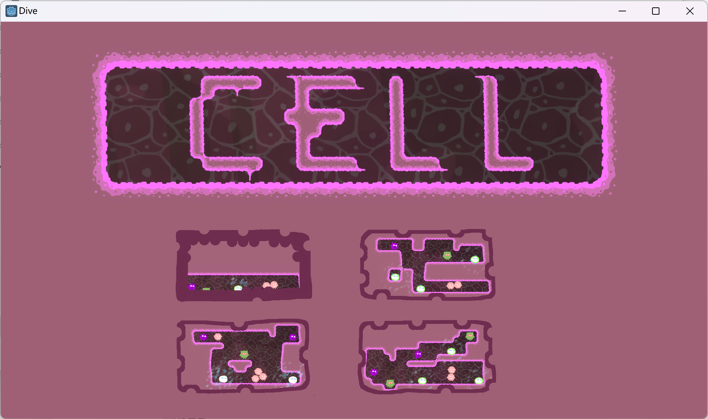
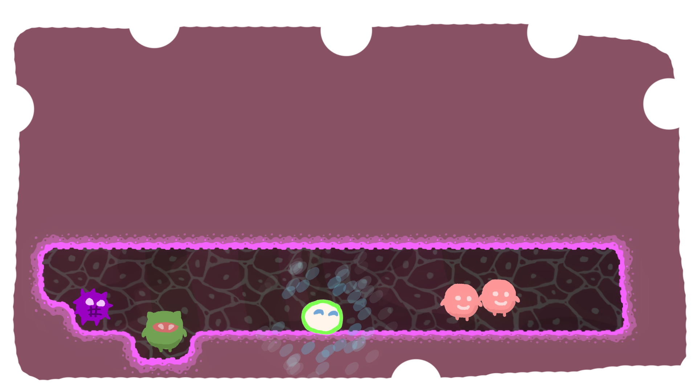
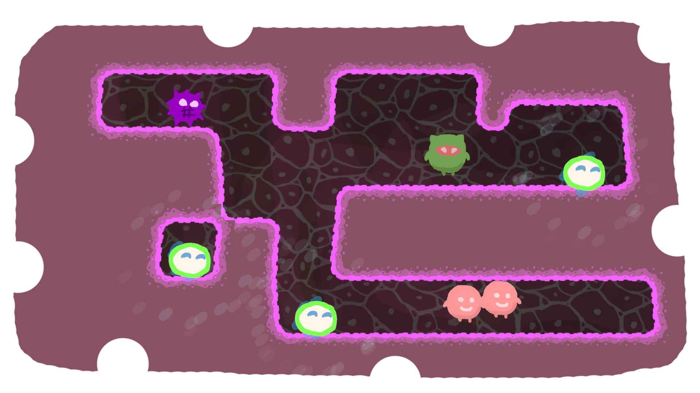
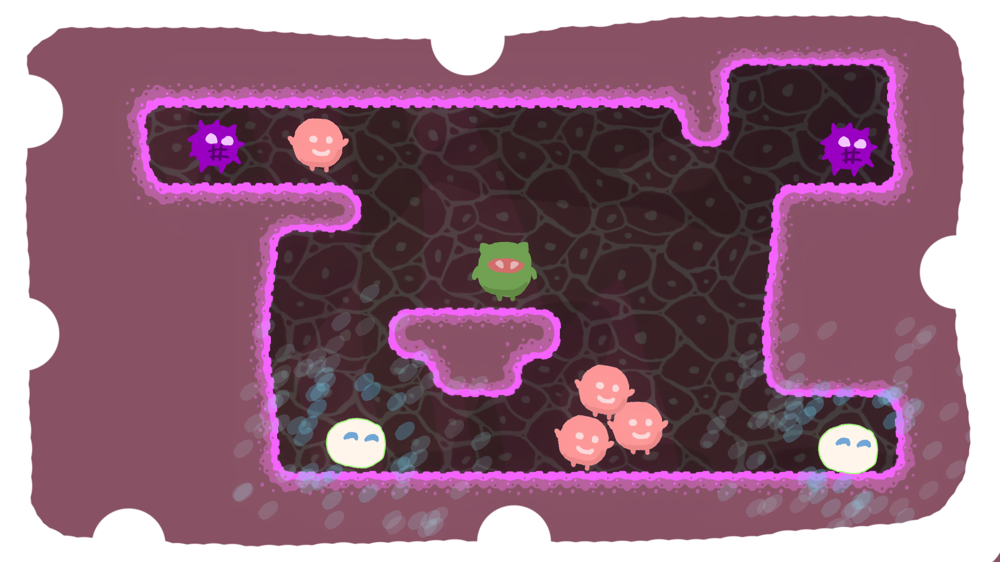
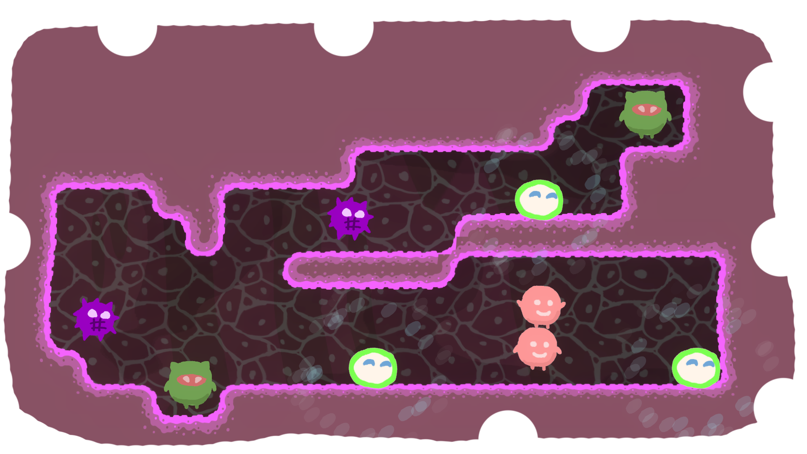
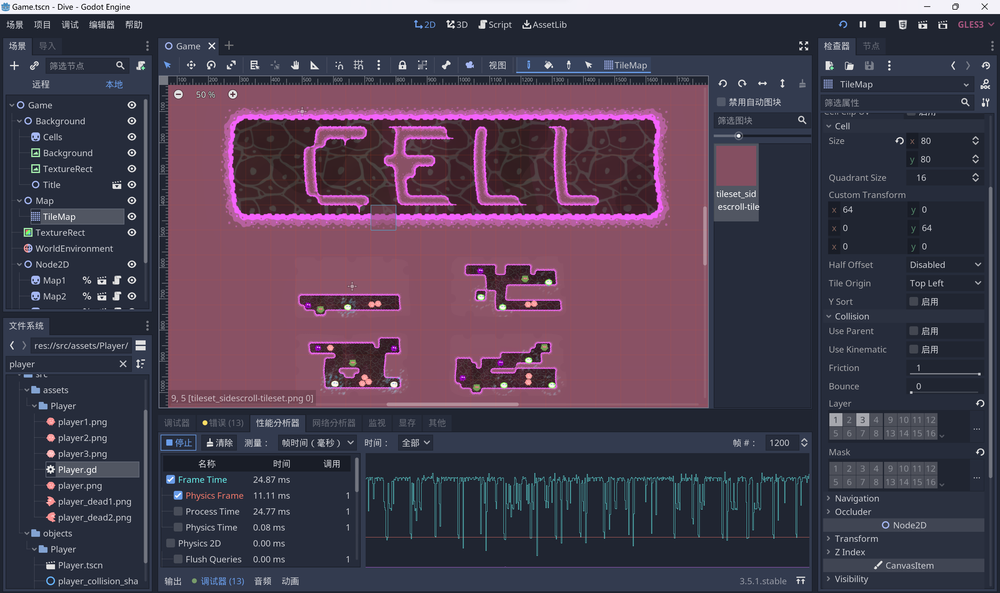

# Dive of Cell for G-bits-GameJam-2022

<center>Dive of Cell --by shaofun 2022/10/5</center>


[TOC]


## GJ 题目

### **48小时 GameJam 开发题目：剥离**

- 解释：剥离可以是同一整体的分离，也可以是对整体单一部分的聚焦，在整体的系统中发生的剥离往往能够带来新的变化，引发新的效应。同时剥离还象征着同一和矛盾，再发散开来能衍生出对抗、还原、蜕变、多面性……等角度让开发者思考

### 作品形式

- 除 VR、AR 以外可运行的游戏 Demo，关卡类游戏不少于 2-3 个关卡，非关卡类游戏需包含游戏核心玩法 5 分钟以上内容。
  作品提交内容：
  - （1）可运行 demo
    （2）试玩视频
    （3）内容介绍 PPT（请参考模板提交）

### 作品提交方式

- Demo 提交截止时间：10 月 6 日 12:00
  【Demo 提交链接】：https://www.wjx.cn/vm/rol3v6P.aspx#

- PPT + 玩法视频提交截止时间：10 月 6 日 18:00
  【PPT + 玩法视频提交】：https://www.wjx.cn/vm/mB4Is2t.aspx#

分两次提交，文件夹命名格式均为：团队名称-队长姓名-成员数量-作品名。


## 我的游戏



### 各种链接

在线试玩：[Dive of Cell by shaofun (itch.io)](https://shaofun.itch.io/dive-of-cell)

下载地址：[Dive of Cell by shaofun (itch.io)](https://shaofun.itch.io/dive-of-cell)

开源地址：[HK-SHAO/G-bits-GameJam-2022: 开源仓库 (github.com)](https://github.com/HK-SHAO/G-bits-GameJam-2022)

实况视频：https://www.bilibili.com/video/BV18W4y1n7dc/

### 关键词

- 元胞自动机(Cellular Automata, CA)
- 生命游戏(Conway's Game of Life)
- 细胞分裂和病毒增殖
- 推箱子

**玩法：利用浆细胞和抗体清除所有病毒和细菌！**


## 游戏机制

1. 细胞分裂

   1. 点击细胞可以分裂出一个新细胞

2. 细胞状态机

   1. ```python
      match(cells_num):
      	0: # 细胞挂掉
      		dead()
      	1: # 一次生成 1 个细胞
      		generate_new_cell()
      	2: # 一次生成 2 个细胞
      		generate_new_cell()
      		generate_new_cell()
      	3: # 生成一个新细胞，老细胞挂掉
      		generate_new_cell()
      		dead()
      	_: # 细胞挂掉
      		dead()
      ```

   2. 根据周围细胞的数量来改变自身状态

   3. 细胞害怕孤独，当细胞单独存在时它会挂掉

   4. 细胞讨厌拥挤，周围细胞太多时，细胞也会挂掉

3. 细胞互相吸引

   1. 细胞喜欢与其他细胞贴贴
   2. 细胞会自发性的聚集起来

4. 病毒增殖

   1. 病毒根据细胞状态来选择增殖数量

5. 细菌会直接破坏细胞

6. 浆细胞释放出的抗体可有效破坏病毒和细菌


## 关卡截图










<div style="page-break-after:always"></div>


## 其他

- 使用 Godot 3.5.1 开发，感谢开源社区 GDQuest，感谢 Godot 官方



- 10.4 中午开始
  - 思考题目，看了会儿视频，然后开始做
  - 中途两次推倒所有代码和场景，重改玩法
  - PS用鼠标画一点点素材
  - 随机生成几段 midi 作为开场音乐
  - 做到晚上 9 点之后开始看番，刷视频然后，睡大觉
- 10.5 感觉没意思
  - 应该重构做个 3D 版本的细胞自动机游戏
  - 所以思考了半天
  - 下午才开始继续做，做了 4 个关卡
  - 打包发布
- 总共其实应该花了 8- 10 个小时左右


哈哈哈，所以这个游戏完全不想做了，因为有更好的 Idea 了